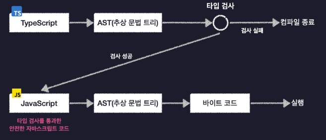

# 타입스크립트 실행과정
- 
- AST(abstract syntax tree)란
    - 소스 코드를 구문 구조에 따라 트리 형태로 표현한 것
    ```
       (+)
      /   \
    2       (-)
           /   \
          3     4
    ```
    - 추상적?
        - 모든 세세한 정보를 나타내지는 않음
        - 추상적인(핵심만 남긴) 트리 구조
# 개발 환경 구축
- Node.js 패키지 초기화
    ``` 
    $ npm init
    ```
- Node.js 내장 기능을 담고 있는 타입 정보 설치
    ```
    $ npm i @types/node
    ```
    - node_modules 폴더에 @types 폴더 생성
- 타입스크립트 컴파일러 설치
    ``` 
    $ npm i -g typescript
    $ tsc -v  # 5.7.3
    ```
- 타입스크립트 실행
    - 타입스크립트 파일 생성
        ``` 
        # src/indexts
        console.log("Hello Typescript");
        const a: number = 1;
        ```
    - tsc로 컴파일하고 실행하기
        ``` 
        $ tsc src/index.ts  # src/indexjs 생성
        $ node src/index.js # 실행
        ```
    - tsx로 타입스크립트 실행하기
        ``` 
        $ npm i -g tsx      # tsx 설치
        $ tsx src/index.ts  # tsx로 typescript 파일 실행
        ```
# 타입스크립트 컴파일 옵션 설정
- 컴파일러 옵션이란
    - 작성한 코드에 타입 오류가 없는지 검사
    - 오류가 없다면 자바스크립트로 변환
    - 컴파일 옵션은 컴파일러의 세부적인 사항들을 설정할 수 있음
- 컴파일러 옵션 자동 생성하기
    ```
    $ tsc --init    # tsconfig.json 생성
    ```
- include 옵션
    - 파일의 범위와 위치 지정
    - skipLibCheck와 같이 지정해야 타입 선언 파일에 대한 검사를 건너뜀
    ```
    "compilerOptions": {
        "skipLibCheck": true /* 타입 선언 파일에 대한 검사 건너뜀 */
    },
    "include": ["src"]
    ```
- target 옵션
    - 변환할 javascript version 지정
    ```
    "compilerOptions": {
        "target: "ES2017" # ES2017 버전으로 변환
    } 
    ```
- module 옵션
    - 자바스크립트 코드의 모듈 시스템 설정
        - CommonJS(old) or ES 모듈 시스템(최근)
    ```
    "compilerOptions": {
        "module": "ESNext" # ESNext(최신 버전) 버전으로 변환
    } 
    ```
- outDir 옵션
    - 컴파일 결과로 생성할 자바스크립트 코드의 위치를 결정
    ```
    "compilerOptions": {
        "outDir": "dist"
    } 
    ```
- strict 옵션
    - 타입스크립트 컴파일러의 타입 검사 엄격함 수준 지정
    ```
    "compilerOptions": {
        "strict": true
    },
    ```
- moduleDetection 옵션
    - 타입스크립트의 모든 파일은 기본적으로 전역 모듈로 취급
    - 각 파일에 모듈 시스템 키워드(export, import)를 사용해야 로컬(독립) 모듈로 취급
    - moduleDetection 옵션을 force로 지정시 자바스크립트에 자동으로 모듈 시스템 키워드가 추가됨
    ```
    {
        "compilerOptions": {
            "moduleDetection": "force"
        }
    }
    ```
