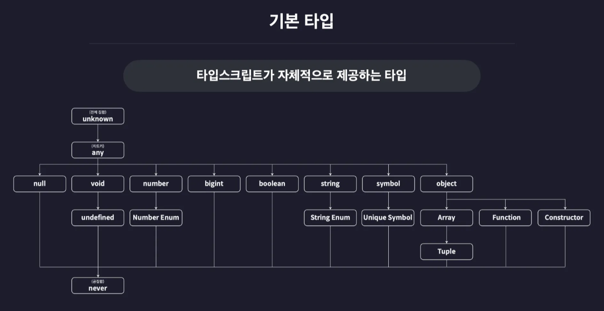

# 타입스크립트 타입

## 기본타입(Basic Types)

- 타입스크립트가 자체적으로 제공하는 타입
  - 

## 원시타입과 리터럴타입

- number 타입
  ```
  // number
  let num1: number = 123;
  let num2: number = -123;
  let num3: number = 0.123;
  let num4: number = -0.123;
  let num5: number = Infinity;
  let num6: number = -Infinity;
  let num7: number = NaN;
  ```
- string 타입
  ```
  // string
  let str1: string = "hello";
  let str2: string = 'hello';
  let str3: string = `hello`;
  let str4: string = `hello ${str1}`;
  ```
- boolean 타입
  ```
  // boolean
  let bool1 : boolean = true;
  let bool2 : boolean = false;
  ```
- null 타입
  ```
  // null
  let null1: null = null;
  ```
- undefined 타입
  ```
  // undefined 타입
  let unde1: undefined = undefined;
  ```
- null 값을 다른 타입의 변수에 할당하기
  ```
  let numA: number = null;  // ❌
  ```
  - 설정에서 null 체크를 제외할 수 있음(비추)
    - strict가 true일때 기본으로 null 체크함
    - strictNullChecks를 false로 지정함으로써 null 체크 안함
  ```
  "compilerOptions": {
    ...
    "strict": true,
    "strictNullChecks": false,
  	...
  },
  ```
- 리터럴 타입
  - 딱 하나의 값만 포함하는 타입
  ```
  let numA: 10 = 10;
  let strA: "hello" = "hello";
  let boolA: true = true;
  let boolB: false = false;
  ```

## 배열과 튜플

- 배열

* 배열 타입 정의 방법 1
  ```
  let numArr: number[] = [1, 2, 3]
  ```
* 배열 타입 정의 방법 2
  ```
  let numArr: Array<number> = [1, 2, 3]
  ```
* 다양한 타입 요소를 갖는 배열 타입 정의
  ```
  let multiArr: (number, string)[] = [1, "hello"];
  ```
* 다차원 배열 타입 정의
  ```
  let doubleArr : number[][] = [
    [1, 2, 3],
    [4, 5],
  ];
  ```

- 튜플

* 자바스크립트에는 없는 길이와 타입이 고정된 배열
  ```
  let tup2: [number, string, boolean] = [1, "hello", true];
  ```
* 컴파일 후에는 배열로 처리됨

  - 자바스크립트의 push와 pop 함수가 사용 가능함으로 타입스크립트에서는 주의할 것

  ```
  let tup1: [number, number] = [1, 2];

  tup1.push(1);
  tup1.push(1);
  tup1.push(1);
  tup1.push(1);
  ```

## 객체

- 객체 타입 정의 방법

* 객체 리터럴 타입

  ```
  let user: {
    id: number;
    name: string;
  } = {
    id: 1,
    name: "이정환",
  };

  user.id;
  ```

* 선택적 프로퍼티 정의하기

  ```
  let user: {
    id: number;
    name: string;
  } = {
    id: 1,
    name: "이정환",
  };

  user = {
    name: "홍길동", // 오류 발생!
  };
  ```

* 선택적 프로퍼티 정의하기

  ```
  let user: {
    id?: number; // 선택적 프로퍼티가 된 id
    name: string;
  } = {
    id: 1,
    name: "이정환",
  };

  user = {
    name: "홍길동",
  };
  ```
## 타입 별칭과 인덱스 시그니처
* src/ch04.ts
## Enum 타입
* src/ch05.ts
## Any와 Unknown 타입
* Any 타입
- Any타입에는 모든 타입의 값을 넣어줄 수 있음
- 모든 타입의 값에 any 타입을 넣어줄 수 있음
* Unknown 타입
- Unknown 타입에는 모든 타입의 값을 넣어줄 수 있음
- Any 타입과는 다르게 반대의 경우에는 컴파일 에러가 발생함
* 컴파일 에러가 없으나 ***런타임 에러***가 발생함
* 타입을 정확히 모를딴 Unknown 타입을 사용하는 것이 안전
## Void와 Never 타입
* void 타입
- 아무것도 없음
- void는 언제 쓰이는가?
  - 함수 리턴 타입 정의시 `undefined`나 `null`로 지정하면 return문에 실제로 적어줘야함
* never 타입
- 불가능한 타입
```
function func1(): never {
  while(true) {}
}

function func2(): never {
  throw new Error();
}
```
