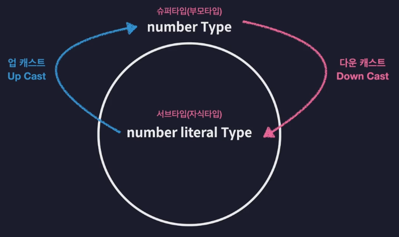
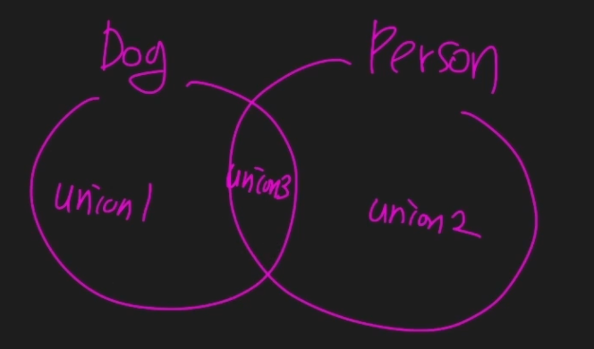

# 타입은 집합이다
* 슈퍼타입(부모타입) - 서브타입(자식타입)
    - ex> number Type - number literal Type
    - ex> 직사각형 - 정사각형
* 타입 호환성
    - 어떤 타입을 다른 타입으로 취급해도 괜찮은진 판단하는 것
    - 
# 타입 계층도와 함께 기본타입 살펴보기 
* 기본타입
    - 
* src/ch06.ts
# 객체 타입의 호환성
* src/ch07.ts
# 대수타입
* src/ch08.ts
    - 
    - 객체의 프로퍼티가 타입의 property내에서 정의가 되는가?
    - Union type(A | B)
        - 업캐스팅 했을때 A 혹은 B 타입에 속하는가?
    - Intersection type
        - 업캐스팅 했을때 A에도 속하고 B에도 속하는가?
# 타입 추론
# 타입 단언